# Stock Walkman UI — screen map

Captured 2026-09-23 on an NW-A55 running Walkman One 3.02, which is Sony's own player UI (Walkman One changes only row heights, the power-off logo and an icon tint). **79 screens, 96 page images and 12 captures of other states**, every one a real 480 × 800 framebuffer grab.

Each screen lists how you reach it and what it opens. [`map.json`](map.json) holds the same data; [`map.html`](map.html) is one self-contained page with every image embedded. The brief for redesigning it is [`DESIGN_BRIEF.md`](DESIGN_BRIEF.md).

**Bottom bar, on almost every screen:** Back (x 55) · Now Playing (x 180) · Library (x 300) · Option menu (x 420).

## How the screens connect

```mermaid
flowchart LR
  subgraph Now_Playing["Now Playing"]
    now_playing["Now Playing"]
    bookmark_list["Bookmark List"]
    bookmark_list_option["Option menu — Bookmark List"]
    play_queue["Play Queue"]
    play_queue_context["Context menu — a Play Queue song"]
    song_info["Detailed Song Information"]
    np_option["Option menu — Now Playing"]
    playback_screen["Change Playback Screen (choice)"]
    lyrics["Lyrics (overlay)"]
    np_help["Now Playing help overlay (the swipe map)"]
    volume["Volume (overlay)"]
  end
  subgraph Sound_panel["Sound panel"]
    sound_dynamic_normalizer["Sound panel — Dynamic Normalizer"]
    sound_vinyl["Sound panel — Vinyl Processor"]
    sound_equalizer["Sound panel — Equalizer"]
    sound_dsee["Sound panel — DSEE HX"]
    sound_dc_phase["Sound panel — DC Phase Linearizer"]
    sound_select_type["Select Type (choice dialog)"]
    saved_sound_settings["Saved Sound Settings"]
    sound_tone_control["Sound panel — Tone Control (replaces the Equalizer page)"]
    eq_adjust["Equalizer — Adjust"]
  end
  subgraph Library["Library"]
    library["Library"]
    recent_transfers["Recent Transfers"]
    album_context["Context menu — an album row"]
    album_songs["An album's songs"]
    song_context["Context menu — a song row"]
    add_to_playlist["Select List to Add to (playlists)"]
    folder["Folder"]
    folder_storage["Folder — a storage's folders"]
    folder_files["Folder — a folder's files"]
    sensme_notice["SensMe™ Channels — songs not analysed notice"]
    sensme_channels["SensMe™ Channels"]
    all_songs["All Songs"]
    album["Album"]
    artist["Artist"]
    artist_albums["An artist's albums"]
    genre["Genre"]
    genre_artists["A genre's artists"]
    release_year["Release Year"]
    year_artists["A year's artists"]
    composer["Composer"]
    playlists["Playlists"]
    playlist_context["Context menu — a playlist row"]
    playlist_songs["A playlist's songs"]
    edit_song_order["Edit Song Order"]
    hires["Hi-Res"]
    usb_dac_confirm["Turn on USB DAC? (dialog)"]
    bt_receiver_confirm["Turn on Bluetooth Receiver? (dialog)"]
    library_option["Option menu — Library"]
    select_items["Select Items to Display"]
    library_help["Library help overlay"]
  end
  subgraph Settings["Settings"]
    settings["Settings"]
    playback_settings["Playback Settings"]
    output_settings["Output Settings"]
    dsd_filter_gain["Select Filtering/Gain (DSD)"]
    high_gain["High Gain Output"]
    lr_balance["L/R Balance"]
    device_settings["Device Settings"]
    screen_off_timer["Screen Off Timer (choice)"]
    usb_connection_settings["USB Connection Settings"]
    auto_power_off["Auto Power Off (choice)"]
    clock_settings["Clock Settings"]
    set_date_time["Set Date-Time (scroll wheels)"]
    date_format["Date Display Format (choice)"]
    language["Language Settings (choice, Cancel/OK)"]
    text_input["Text Input (keyboard choice)"]
    reset_format["Reset/Format (every item destructive — not opened)"]
    sound_settings["Sound Settings"]
    settings_dsee["DSEE HX (from Settings; DC Phase, Dynamic Normalizer and Vinyl open the same way)"]
    settings_equalizer["Equalizer (from Settings)"]
    hq_sound_guide["Guide to High Quality Sound (2 pages)"]
    bt_connection_settings["Audio Device Connection Settings"]
    wireless_quality["Wireless Playback Quality (choice)"]
    receiver_quality["Receiver Playback Quality (choice)"]
    bt_information["Bluetooth Information (device address blacked out)"]
    usb_dac_settings["USB DAC Settings"]
    unit_information["Unit Information"]
    sleep_timer["Sleep Timer (choice dialog)"]
    bt_devices["Connect to/Add Audio Device (Bluetooth)"]
  end
  subgraph System["System"]
    usb_mass_storage["USB Mass Storage"]
  end
  now_playing -- "swipe left" --> bookmark_list
  bookmark_list -- "tap Option (toolbox)" --> bookmark_list_option
  now_playing -- "swipe right" --> play_queue
  play_queue -- "tap a row's ⋯ button" --> play_queue_context
  play_queue_context -- "tap Detailed Song Information" --> song_info
  bookmark_list_option -- "tap Settings" --> settings
  settings -- "tap Playback Settings" --> playback_settings
  now_playing -- "swipe down, or tap the Library b…" --> library
  library -- "page 2: tap Recent Transfers" --> recent_transfers
  recent_transfers -- "tap an album row's ⋯ button" --> album_context
  recent_transfers -- "tap an album" --> album_songs
  album_songs -- "tap a song row's ⋯ button" --> song_context
  song_context -- "tap Detailed Song Information" --> song_info
  song_context -- "tap Add to Playlist" --> add_to_playlist
  library -- "page 2: tap Folder" --> folder
  folder -- "tap System Storage or SD Card" --> folder_storage
  folder_storage -- "tap a folder" --> folder_files
  library -- "page 2: tap SensMe™ Channels (st…" --> sensme_notice
  sensme_notice -- "tap OK" --> sensme_channels
  library -- "tap All Songs" --> all_songs
  all_songs -- "tap a song (it starts playing)" --> now_playing
  library -- "tap Album" --> album
  album -- "tap an album" --> album_songs
  album -- "tap an album row's ⋯ button" --> album_context
  library -- "tap Artist" --> artist
  artist -- "tap an artist" --> artist_albums
  artist_albums -- "tap an album" --> album_songs
  library -- "tap Genre" --> genre
  genre -- "tap a genre" --> genre_artists
  genre_artists -- "tap an artist" --> artist_albums
  library -- "tap Release Year" --> release_year
  release_year -- "tap a year" --> year_artists
  library -- "tap Composer" --> composer
  library -- "tap Playlists" --> playlists
  playlists -- "tap a playlist row's ⋯ button" --> playlist_context
  playlists -- "tap a playlist" --> playlist_songs
  playlist_songs -- "Option menu: tap Edit Song Order" --> edit_song_order
  library -- "tap Hi-Res" --> hires
  library -- "tap the DAC button" --> usb_dac_confirm
  library -- "tap the phone-and-waves button" --> bt_receiver_confirm
  library -- "tap Option (toolbox)" --> library_option
  library_option -- "tap Select Items to Display" --> select_items
  library_option -- "tap View Help" --> library_help
  now_playing -- "tap Option (toolbox)" --> np_option
  np_option -- "tap Change Playback Screen" --> playback_screen
  np_option -- "tap Display Lyrics" --> lyrics
  np_option -- "tap View Help" --> np_help
  now_playing -- "tap the status bar (any screen)" --> volume
  now_playing -- "swipe up (page 4 of 5)" --> sound_dynamic_normalizer
  sound_dynamic_normalizer -- "swipe left (page 5)" --> sound_vinyl
  now_playing -- "swipe up (page 1; the panel reop…" --> sound_equalizer
  sound_equalizer -- "swipe left (page 2)" --> sound_dsee
  sound_dsee -- "swipe left (page 3)" --> sound_dc_phase
  sound_dc_phase -- "swipe left" --> sound_dynamic_normalizer
  sound_vinyl -- "swipe left (wraps)" --> sound_equalizer
  sound_dc_phase -- "tap the Select Type box (same on…" --> sound_select_type
  sound_dc_phase -- "Option menu: tap Saved Sound Set…" --> saved_sound_settings
  sound_equalizer -- "Option menu: tap Tone Control" --> sound_tone_control
  sound_tone_control -- "Option menu: tap Equalizer (swit…" --> sound_equalizer
  sound_equalizer -- "tap Adjust" --> eq_adjust
  np_option -- "tap Settings" --> settings
  settings -- "tap Output Settings" --> output_settings
  output_settings -- "tap Select Filtering/Gain" --> dsd_filter_gain
  output_settings -- "tap High Gain Output" --> high_gain
  output_settings -- "tap L/R Balance" --> lr_balance
  settings -- "tap Device Settings" --> device_settings
  device_settings -- "tap Screen Off Timer" --> screen_off_timer
  device_settings -- "tap USB Connection Settings" --> usb_connection_settings
  device_settings -- "tap Auto Power Off" --> auto_power_off
  device_settings -- "tap Clock Settings" --> clock_settings
  clock_settings -- "tap Set Date-Time" --> set_date_time
  clock_settings -- "tap Date Display Format" --> date_format
  device_settings -- "tap Language Settings" --> language
  device_settings -- "tap Text Input" --> text_input
  device_settings -- "tap Reset/Format" --> reset_format
  settings -- "tap Saved Sound Settings" --> saved_sound_settings
  settings -- "tap Sound Settings" --> sound_settings
  sound_settings -- "tap DSEE HX (or any effect row)" --> settings_dsee
  sound_settings -- "tap Equalizer/Tone Control" --> settings_equalizer
  settings_equalizer -- "tap Adjust" --> eq_adjust
  settings -- "tap Guide to High Quality Sound" --> hq_sound_guide
  settings -- "tap Audio Device Connection Sett…" --> bt_connection_settings
  bt_connection_settings -- "tap Wireless Playback Quality" --> wireless_quality
  settings -- "tap Receiver Playback Quality" --> receiver_quality
  settings -- "tap Bluetooth Information" --> bt_information
  settings -- "tap USB DAC Settings" --> usb_dac_settings
  settings -- "tap Unit Information" --> unit_information
  playback_settings -- "tap the Sleep Timer box" --> sleep_timer
  settings -- "tap Connect to/Add Audio Device" --> bt_devices
  np_option -- "tap Detailed Song Information" --> song_info
  np_option -- "tap Add to Playlist (Add to Book…" --> add_to_playlist
  play_queue_context -- "tap Add to Playlist" --> add_to_playlist
```

## Now Playing

The start screen. Four more screens hang off it by swipes only.

### Now Playing 

Swipe left: Bookmark List. Swipe right: Play Queue. Swipe up: sound panel. Swipe down: Library. Nothing on screen shows these; the help overlay does.

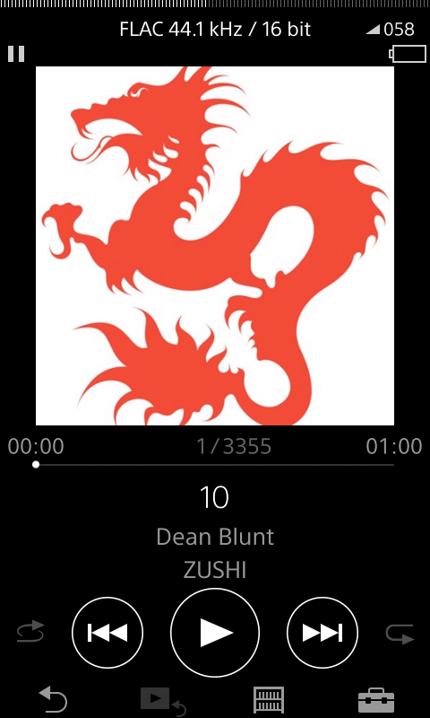

- **Reached from:** [All Songs](#all_songs) — tap a song (it starts playing)
- **Opens:** swipe left → [Bookmark List](#bookmark_list); swipe right → [Play Queue](#play_queue); swipe down, or tap the Library button → [Library](#library); tap Option (toolbox) → [Option menu — Now Playing](#np_option); tap the status bar (any screen) → [Volume (overlay)](#volume); swipe up (page 4 of 5) → [Sound panel — Dynamic Normalizer](#sound_dynamic_normalizer); swipe up (page 1; the panel reopens on the last page used, and pages wrap) → [Sound panel — Equalizer](#sound_equalizer)
- **Other state:** [Change Playback Screen → Spectrum Analyzer (while playing)](screens/now_playing__s1.png)
- **Other state:** [Change Playback Screen → Analog Level Meter (while playing)](screens/now_playing__s2.png)
- **Other state:** [Change Playback Screen → Digital Peak Meter (while playing)](screens/now_playing__s3.png)

### Bookmark List 

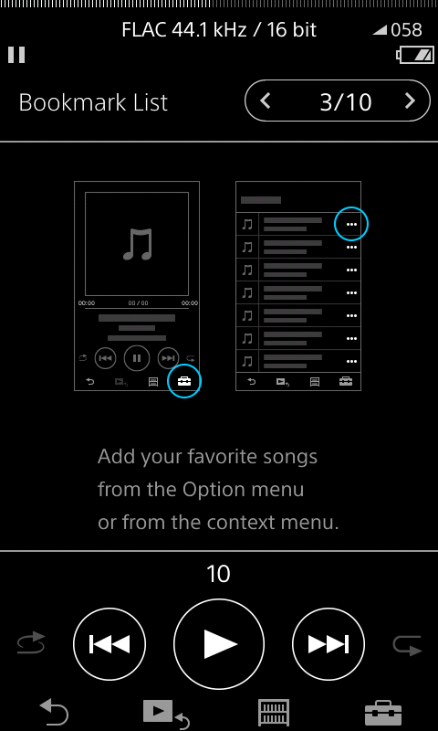

- **Reached from:** [Now Playing](#now_playing) — swipe left
- **Opens:** tap Option (toolbox) → [Option menu — Bookmark List](#bookmark_list_option)

### Option menu — Bookmark List 

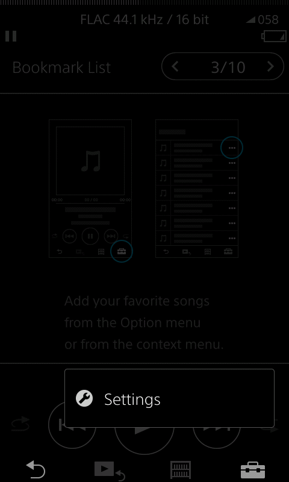

- **Reached from:** [Bookmark List](#bookmark_list) — tap Option (toolbox)
- **Opens:** tap Settings → [Settings](#settings)

### Play Queue 

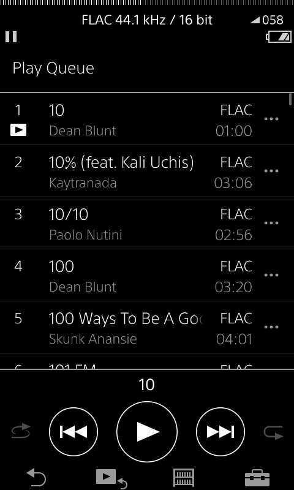

- **Reached from:** [Now Playing](#now_playing) — swipe right
- **Opens:** tap a row's ⋯ button → [Context menu — a Play Queue song](#play_queue_context)

### Context menu — a Play Queue song 

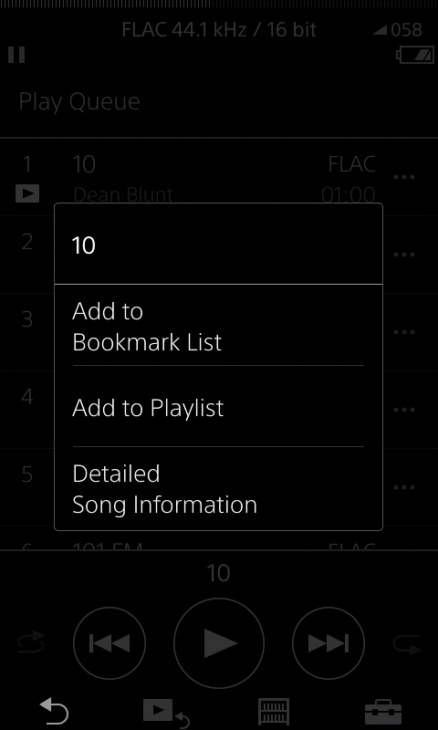

- **Reached from:** [Play Queue](#play_queue) — tap a row's ⋯ button
- **Opens:** tap Detailed Song Information → [Detailed Song Information](#song_info); tap Add to Playlist → [Select List to Add to (playlists)](#add_to_playlist)

### Detailed Song Information 

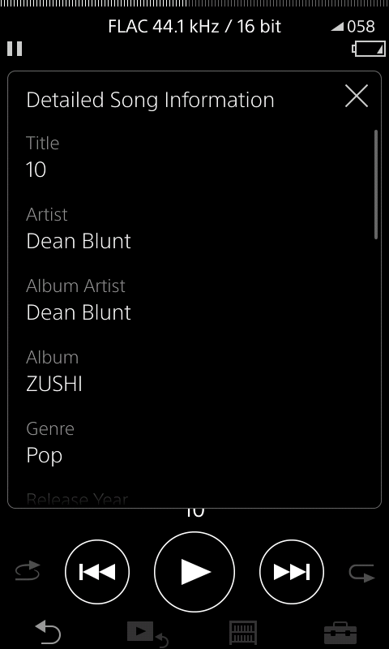

- **Reached from:** [Context menu — a Play Queue song](#play_queue_context) — tap Detailed Song Information; [Context menu — a song row](#song_context) — tap Detailed Song Information; [Option menu — Now Playing](#np_option) — tap Detailed Song Information

### Option menu — Now Playing 

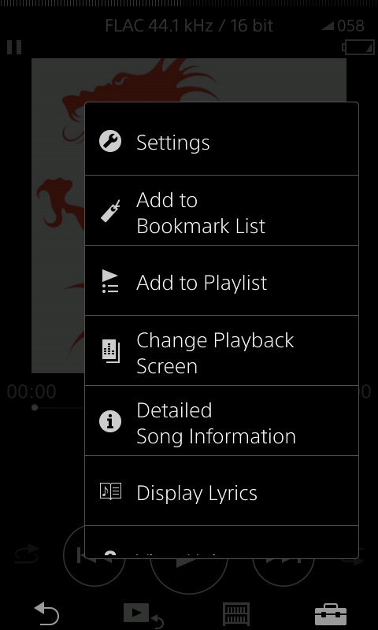 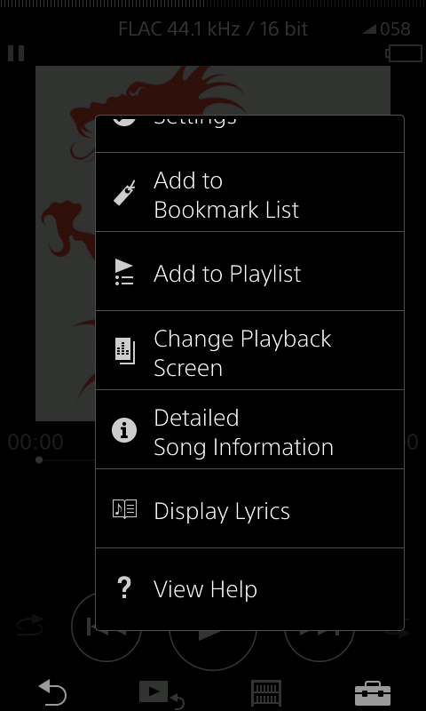

- **Reached from:** [Now Playing](#now_playing) — tap Option (toolbox)
- **Opens:** tap Change Playback Screen → [Change Playback Screen (choice)](#playback_screen); tap Display Lyrics → [Lyrics (overlay)](#lyrics); tap View Help → [Now Playing help overlay (the swipe map)](#np_help); tap Settings → [Settings](#settings); tap Detailed Song Information → [Detailed Song Information](#song_info); tap Add to Playlist (Add to Bookmark List opens the same kind of picker) → [Select List to Add to (playlists)](#add_to_playlist)

### Change Playback Screen (choice) 

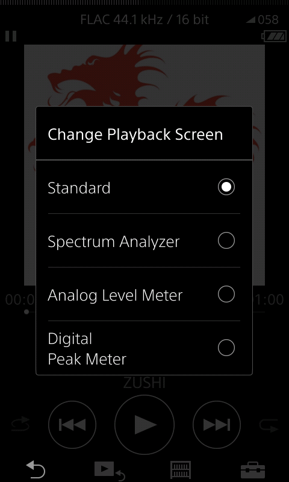

- **Reached from:** [Option menu — Now Playing](#np_option) — tap Change Playback Screen

### Lyrics (overlay) 

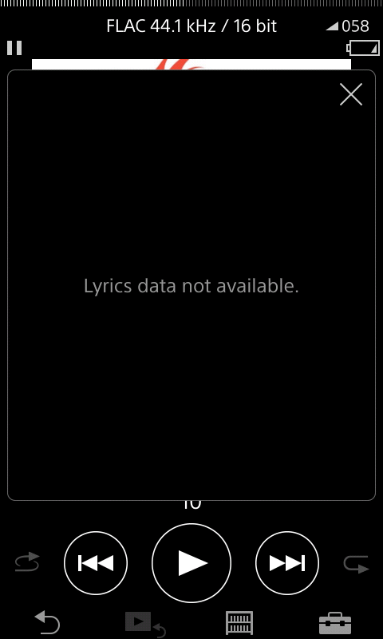

- **Reached from:** [Option menu — Now Playing](#np_option) — tap Display Lyrics

### Now Playing help overlay (the swipe map) 

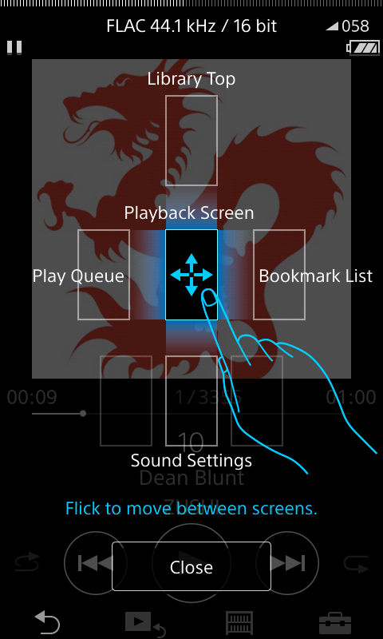

- **Reached from:** [Option menu — Now Playing](#np_option) — tap View Help

### Volume (overlay) 

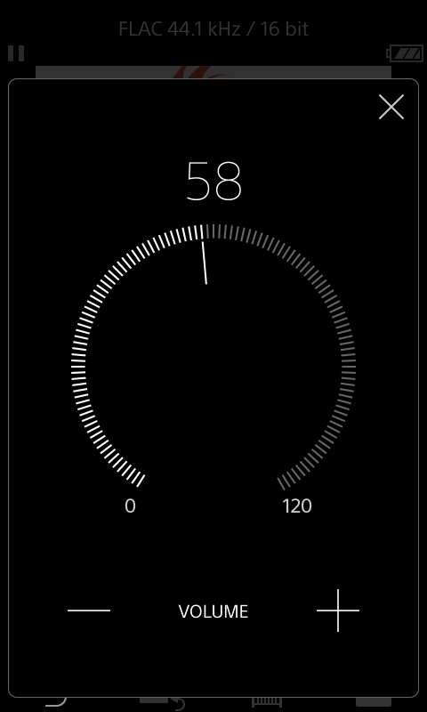

- **Reached from:** [Now Playing](#now_playing) — tap the status bar (any screen)

## Sound panel

Swipe up on Now Playing: five effect pages side by side, with the Direct switch in the title strip.

### Sound panel — Dynamic Normalizer 

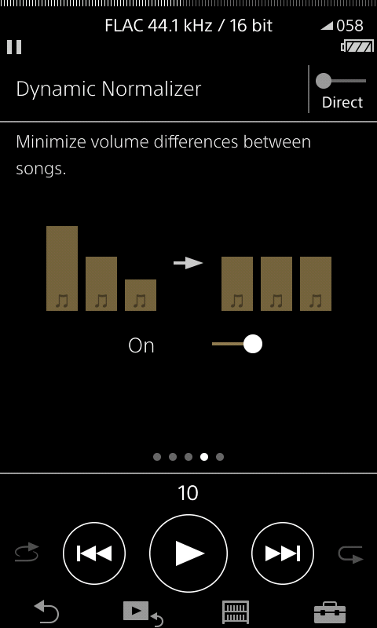

- **Reached from:** [Now Playing](#now_playing) — swipe up (page 4 of 5); [Sound panel — DC Phase Linearizer](#sound_dc_phase) — swipe left
- **Opens:** swipe left (page 5) → [Sound panel — Vinyl Processor](#sound_vinyl)

### Sound panel — Vinyl Processor 

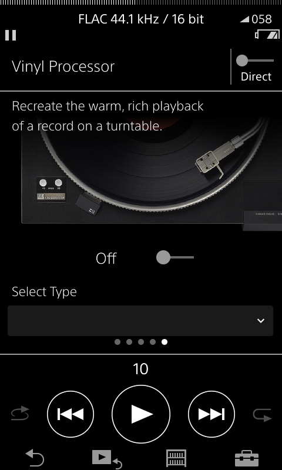

- **Reached from:** [Sound panel — Dynamic Normalizer](#sound_dynamic_normalizer) — swipe left (page 5)
- **Opens:** swipe left (wraps) → [Sound panel — Equalizer](#sound_equalizer)

### Sound panel — Equalizer 

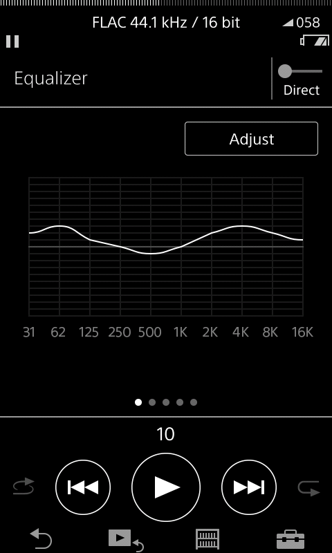

- **Reached from:** [Now Playing](#now_playing) — swipe up (page 1; the panel reopens on the last page used, and pages wrap); [Sound panel — Vinyl Processor](#sound_vinyl) — swipe left (wraps); [Sound panel — Tone Control (replaces the Equalizer page)](#sound_tone_control) — Option menu: tap Equalizer (switches back)
- **Opens:** swipe left (page 2) → [Sound panel — DSEE HX](#sound_dsee); Option menu: tap Tone Control → [Sound panel — Tone Control (replaces the Equalizer page)](#sound_tone_control); tap Adjust → [Equalizer — Adjust](#eq_adjust)
- **Other state:** [tap Option (toolbox): Saved Sound Settings, Tone Control](screens/sound_equalizer__s1.png)
- **Other state:** [tap the Direct switch: Direct Source On — every sound setting is bypassed](screens/sound_equalizer__s2.png)

### Sound panel — DSEE HX 

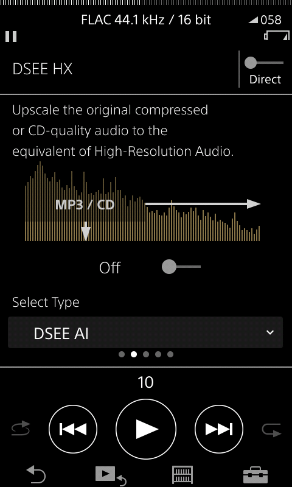

- **Reached from:** [Sound panel — Equalizer](#sound_equalizer) — swipe left (page 2)
- **Opens:** swipe left (page 3) → [Sound panel — DC Phase Linearizer](#sound_dc_phase)

### Sound panel — DC Phase Linearizer 

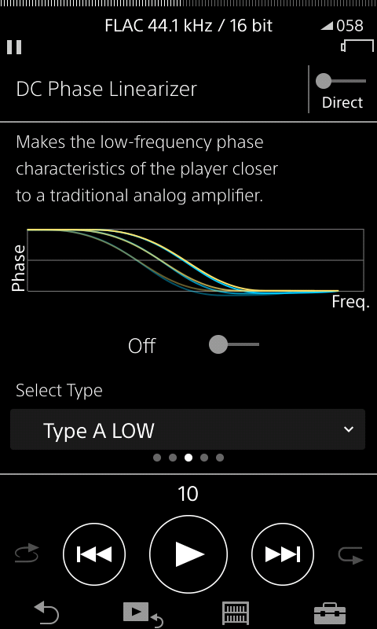

- **Reached from:** [Sound panel — DSEE HX](#sound_dsee) — swipe left (page 3)
- **Opens:** swipe left → [Sound panel — Dynamic Normalizer](#sound_dynamic_normalizer); tap the Select Type box (same on DSEE HX and Vinyl Processor) → [Select Type (choice dialog)](#sound_select_type); Option menu: tap Saved Sound Settings (also a Settings row) → [Saved Sound Settings](#saved_sound_settings)
- **Other state:** [tap Option (toolbox): Saved Sound Settings (the Equalizer page adds Tone Control)](screens/sound_dc_phase__s1.png)

### Select Type (choice dialog) 

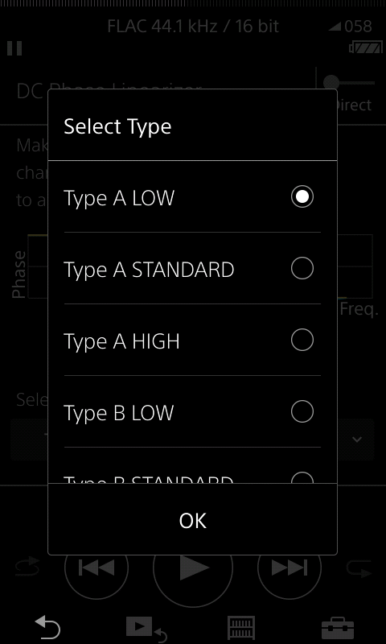

- **Reached from:** [Sound panel — DC Phase Linearizer](#sound_dc_phase) — tap the Select Type box (same on DSEE HX and Vinyl Processor)

### Saved Sound Settings 

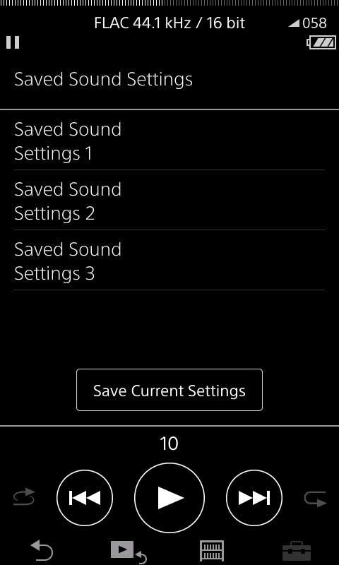

- **Reached from:** [Sound panel — DC Phase Linearizer](#sound_dc_phase) — Option menu: tap Saved Sound Settings (also a Settings row); [Settings](#settings) — tap Saved Sound Settings

### Sound panel — Tone Control (replaces the Equalizer page) 

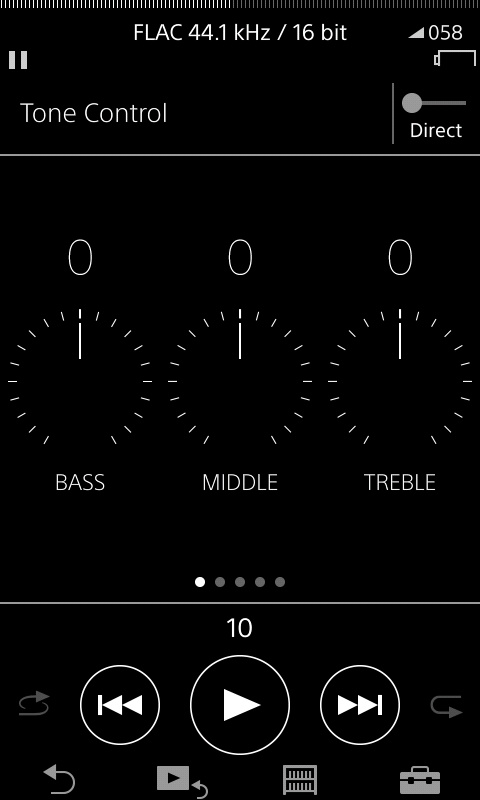

- **Reached from:** [Sound panel — Equalizer](#sound_equalizer) — Option menu: tap Tone Control
- **Opens:** Option menu: tap Equalizer (switches back) → [Sound panel — Equalizer](#sound_equalizer)

### Equalizer — Adjust 

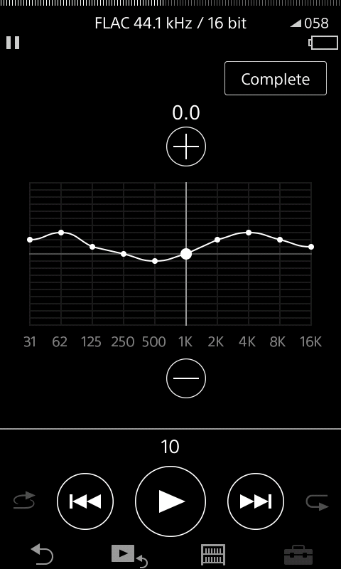

- **Reached from:** [Sound panel — Equalizer](#sound_equalizer) — tap Adjust; [Equalizer (from Settings)](#settings_equalizer) — tap Adjust

## Library

Swipe down on Now Playing, or the Library button in the bottom bar.

### Library 

Two pages of category tiles (swipe left/right). Tap and hold a tile to reorder. The DAC and phone buttons ask to turn on USB DAC / Bluetooth Receiver.

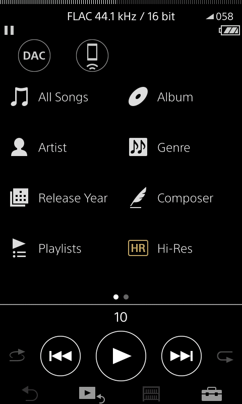 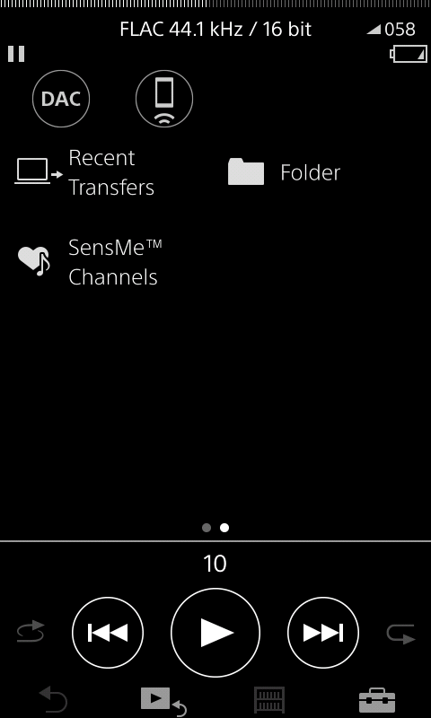

- **Reached from:** [Now Playing](#now_playing) — swipe down, or tap the Library button
- **Opens:** page 2: tap Recent Transfers → [Recent Transfers](#recent_transfers); page 2: tap Folder → [Folder](#folder); page 2: tap SensMe™ Channels (starts a channel playing) → [SensMe™ Channels — songs not analysed notice](#sensme_notice); tap All Songs → [All Songs](#all_songs); tap Album → [Album](#album); tap Artist → [Artist](#artist); tap Genre → [Genre](#genre); tap Release Year → [Release Year](#release_year); tap Composer → [Composer](#composer); tap Playlists → [Playlists](#playlists); tap Hi-Res → [Hi-Res](#hires); tap the DAC button → [Turn on USB DAC? (dialog)](#usb_dac_confirm); tap the phone-and-waves button → [Turn on Bluetooth Receiver? (dialog)](#bt_receiver_confirm); tap Option (toolbox) → [Option menu — Library](#library_option)

### Recent Transfers 

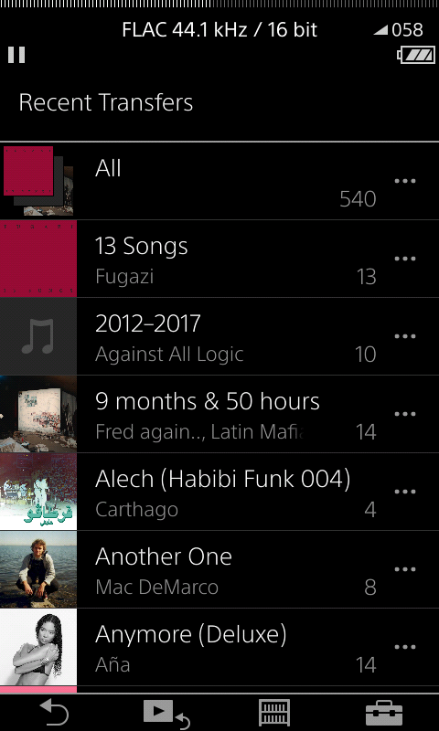

- **Reached from:** [Library](#library) — page 2: tap Recent Transfers
- **Opens:** tap an album row's ⋯ button → [Context menu — an album row](#album_context); tap an album → [An album's songs](#album_songs)
- **Other state:** [tap Option (toolbox): a popup with Settings only](screens/recent_transfers__s1.png)

### Context menu — an album row 

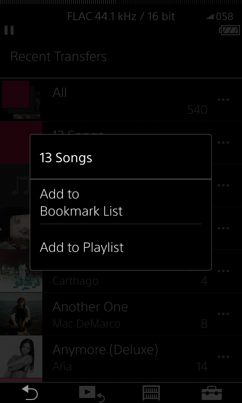

- **Reached from:** [Recent Transfers](#recent_transfers) — tap an album row's ⋯ button; [Album](#album) — tap an album row's ⋯ button

### An album's songs 

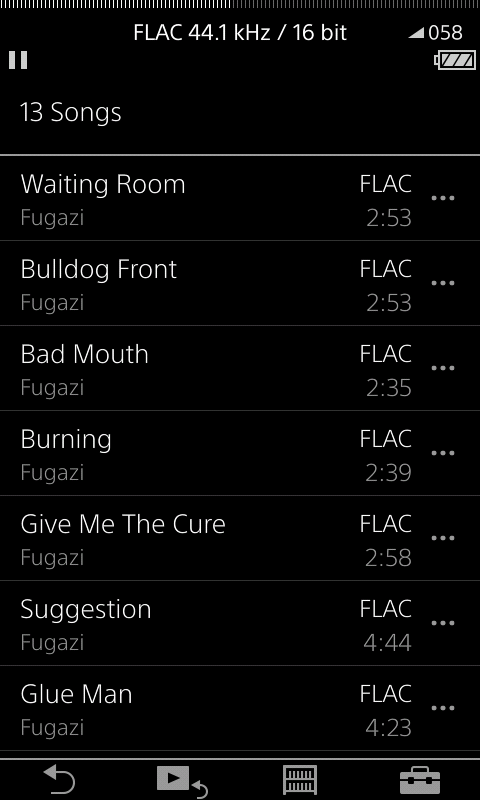

- **Reached from:** [Recent Transfers](#recent_transfers) — tap an album; [Album](#album) — tap an album; [An artist's albums](#artist_albums) — tap an album
- **Opens:** tap a song row's ⋯ button → [Context menu — a song row](#song_context)

### Context menu — a song row 

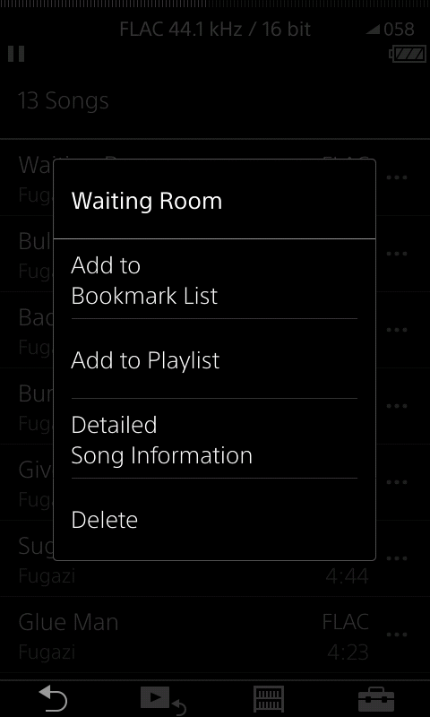

- **Reached from:** [An album's songs](#album_songs) — tap a song row's ⋯ button
- **Opens:** tap Detailed Song Information → [Detailed Song Information](#song_info); tap Add to Playlist → [Select List to Add to (playlists)](#add_to_playlist)

### Select List to Add to (playlists) 

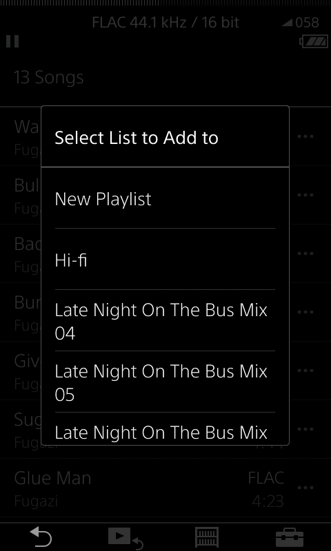

- **Reached from:** [Context menu — a song row](#song_context) — tap Add to Playlist; [Option menu — Now Playing](#np_option) — tap Add to Playlist (Add to Bookmark List opens the same kind of picker); [Context menu — a Play Queue song](#play_queue_context) — tap Add to Playlist

### Folder 

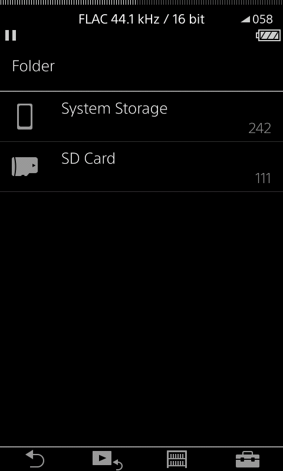

- **Reached from:** [Library](#library) — page 2: tap Folder
- **Opens:** tap System Storage or SD Card → [Folder — a storage's folders](#folder_storage)

### Folder — a storage's folders 

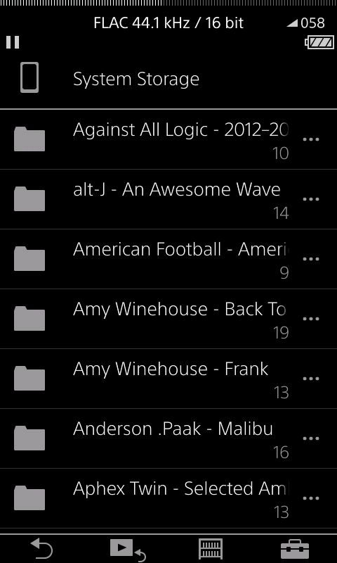

- **Reached from:** [Folder](#folder) — tap System Storage or SD Card
- **Opens:** tap a folder → [Folder — a folder's files](#folder_files)

### Folder — a folder's files 

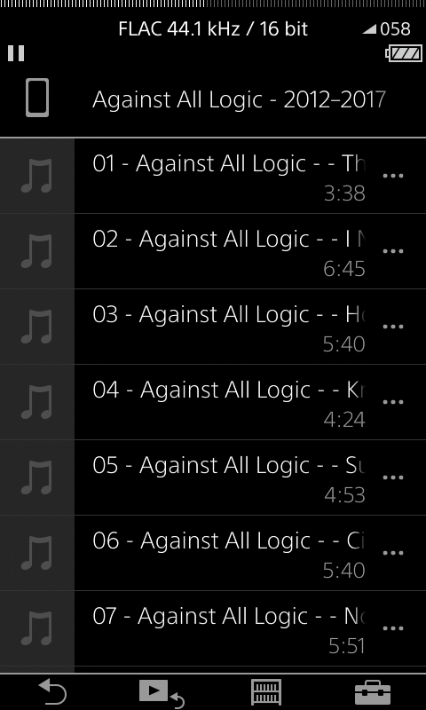

- **Reached from:** [Folder — a storage's folders](#folder_storage) — tap a folder

### SensMe™ Channels — songs not analysed notice 

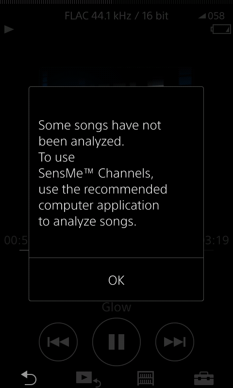

- **Reached from:** [Library](#library) — page 2: tap SensMe™ Channels (starts a channel playing)
- **Opens:** tap OK → [SensMe™ Channels](#sensme_channels)

### SensMe™ Channels 

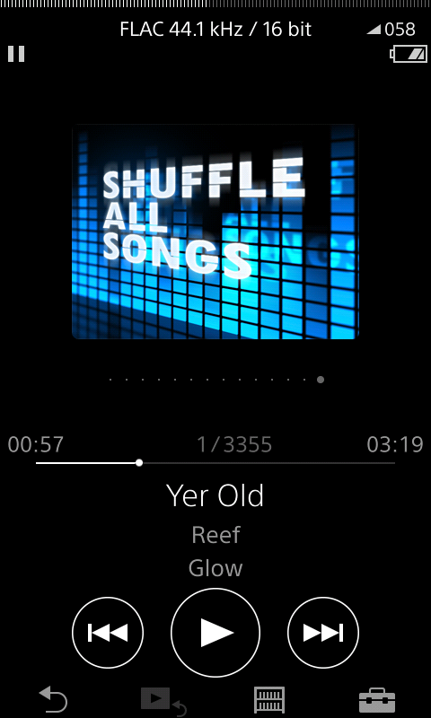

- **Reached from:** [SensMe™ Channels — songs not analysed notice](#sensme_notice) — tap OK

### All Songs 

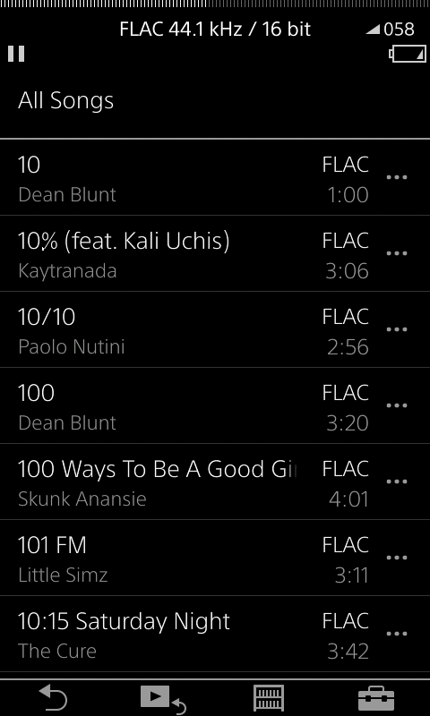

- **Reached from:** [Library](#library) — tap All Songs
- **Opens:** tap a song (it starts playing) → [Now Playing](#now_playing)

### Album 

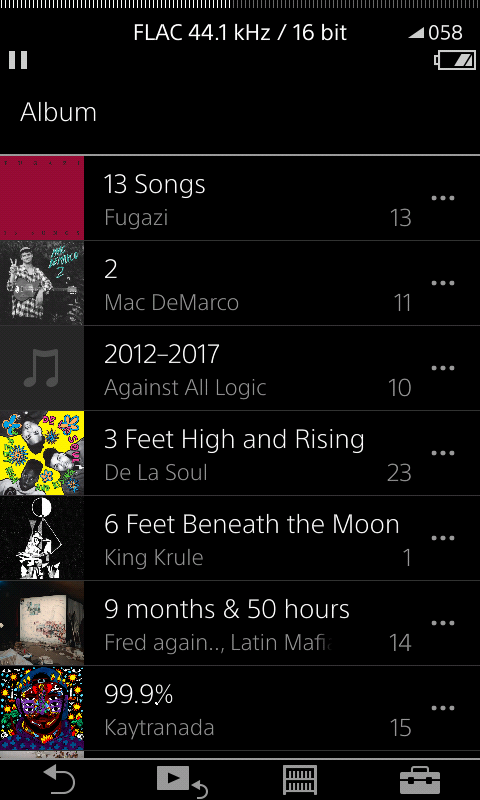

- **Reached from:** [Library](#library) — tap Album
- **Opens:** tap an album → [An album's songs](#album_songs); tap an album row's ⋯ button → [Context menu — an album row](#album_context)

### Artist 

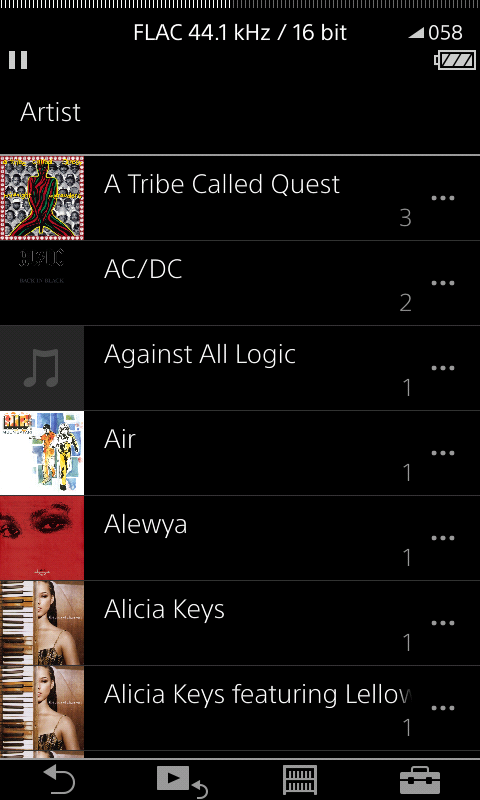

- **Reached from:** [Library](#library) — tap Artist
- **Opens:** tap an artist → [An artist's albums](#artist_albums)

### An artist's albums 

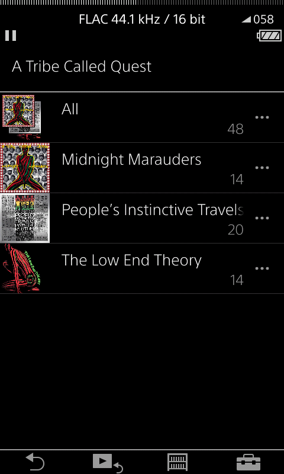

- **Reached from:** [Artist](#artist) — tap an artist; [A genre's artists](#genre_artists) — tap an artist
- **Opens:** tap an album → [An album's songs](#album_songs)

### Genre 

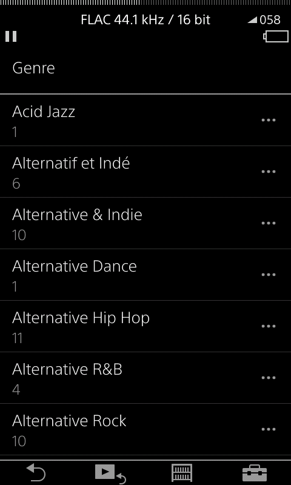

- **Reached from:** [Library](#library) — tap Genre
- **Opens:** tap a genre → [A genre's artists](#genre_artists)

### A genre's artists 

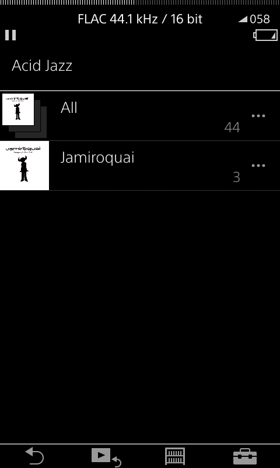

- **Reached from:** [Genre](#genre) — tap a genre
- **Opens:** tap an artist → [An artist's albums](#artist_albums)

### Release Year 

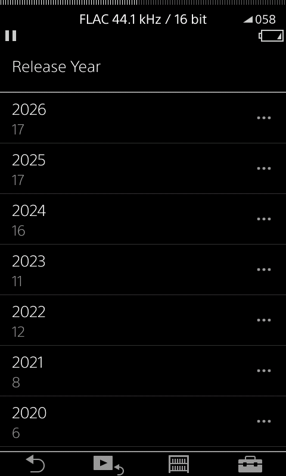

- **Reached from:** [Library](#library) — tap Release Year
- **Opens:** tap a year → [A year's artists](#year_artists)

### A year's artists 

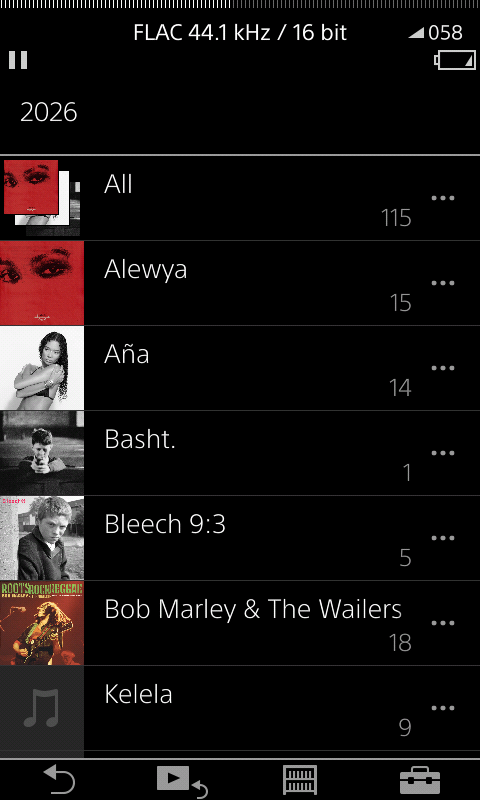

- **Reached from:** [Release Year](#release_year) — tap a year

### Composer 

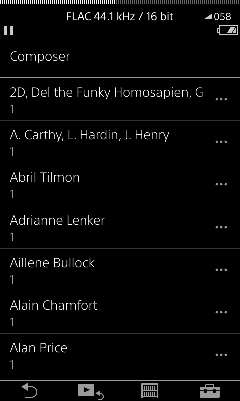

- **Reached from:** [Library](#library) — tap Composer

### Playlists 

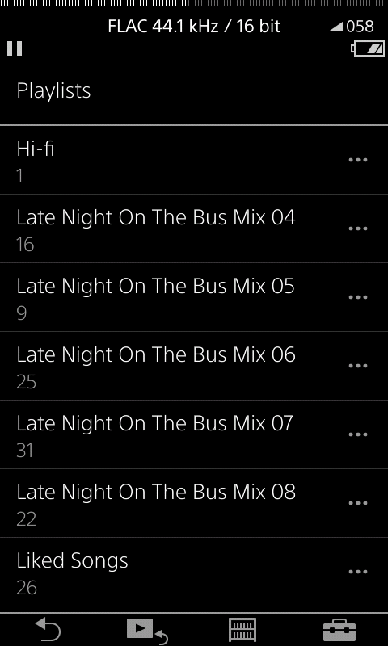

- **Reached from:** [Library](#library) — tap Playlists
- **Opens:** tap a playlist row's ⋯ button → [Context menu — a playlist row](#playlist_context); tap a playlist → [A playlist's songs](#playlist_songs)

### Context menu — a playlist row 

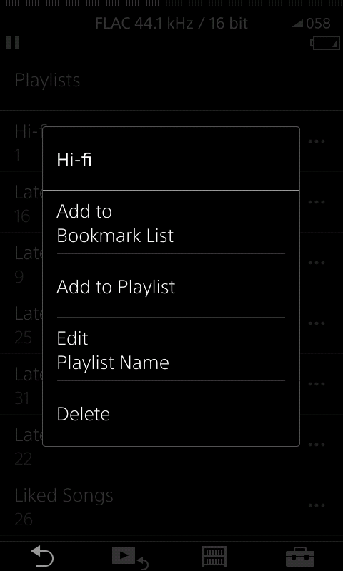

- **Reached from:** [Playlists](#playlists) — tap a playlist row's ⋯ button

### A playlist's songs 

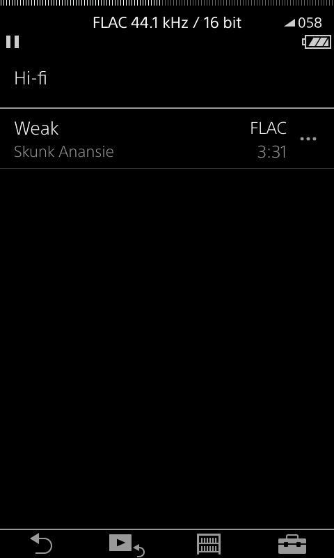

- **Reached from:** [Playlists](#playlists) — tap a playlist
- **Opens:** Option menu: tap Edit Song Order → [Edit Song Order](#edit_song_order)
- **Other state:** [tap Option (toolbox): Settings, Edit Song Order](screens/playlist_songs__s1.png)

### Edit Song Order 

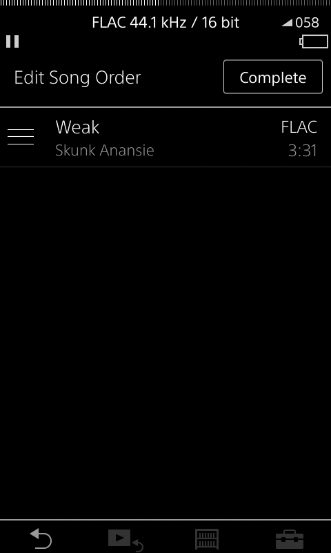

- **Reached from:** [A playlist's songs](#playlist_songs) — Option menu: tap Edit Song Order
- **Other state:** [tap Back: 'Your changes will not be saved' — No / Yes](screens/edit_song_order__s1.png)

### Hi-Res 

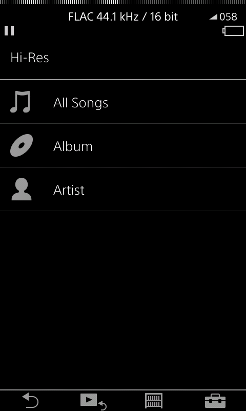

- **Reached from:** [Library](#library) — tap Hi-Res

### Turn on USB DAC? (dialog) 

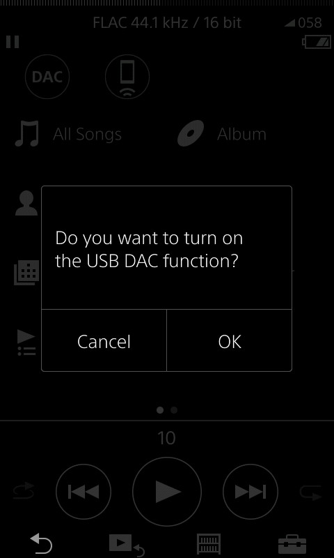

- **Reached from:** [Library](#library) — tap the DAC button

### Turn on Bluetooth Receiver? (dialog) 

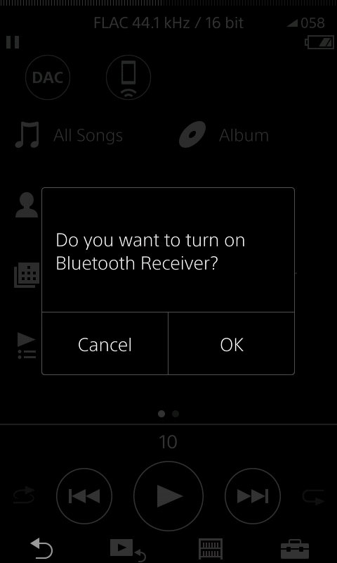

- **Reached from:** [Library](#library) — tap the phone-and-waves button

### Option menu — Library 

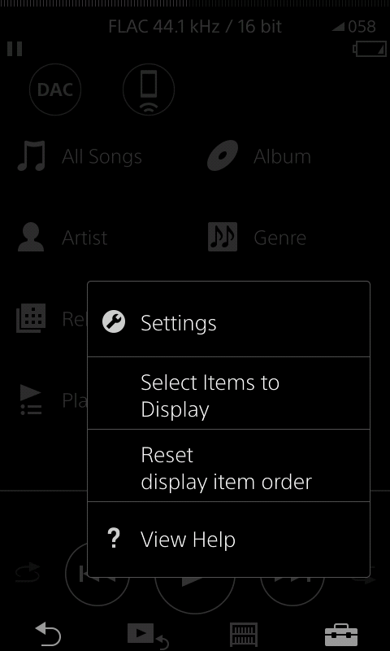

- **Reached from:** [Library](#library) — tap Option (toolbox)
- **Opens:** tap Select Items to Display → [Select Items to Display](#select_items); tap View Help → [Library help overlay](#library_help)

### Select Items to Display 

  

- **Reached from:** [Option menu — Library](#library_option) — tap Select Items to Display

### Library help overlay 


- **Reached from:** [Option menu — Library](#library_option) — tap View Help

## Settings

First item of every Option (toolbox) menu.

### Settings 

Every Option (toolbox) menu has Settings as its first item.

    

- **Reached from:** [Option menu — Bookmark List](#bookmark_list_option) — tap Settings; [Option menu — Now Playing](#np_option) — tap Settings
- **Opens:** tap Playback Settings → [Playback Settings](#playback_settings); tap Output Settings → [Output Settings](#output_settings); tap Device Settings → [Device Settings](#device_settings); tap Saved Sound Settings → [Saved Sound Settings](#saved_sound_settings); tap Sound Settings → [Sound Settings](#sound_settings); tap Guide to High Quality Sound → [Guide to High Quality Sound (2 pages)](#hq_sound_guide); tap Audio Device Connection Settings → [Audio Device Connection Settings](#bt_connection_settings); tap Receiver Playback Quality → [Receiver Playback Quality (choice)](#receiver_quality); tap Bluetooth Information → [Bluetooth Information (device address blacked out)](#bt_information); tap USB DAC Settings → [USB DAC Settings](#usb_dac_settings); tap Unit Information → [Unit Information](#unit_information); tap Connect to/Add Audio Device → [Connect to/Add Audio Device (Bluetooth)](#bt_devices)
- **Other state:** [tap the brightness icon: the brightness slider opens](screens/settings__s1.png)
- **Other state:** [tap the Bluetooth icon: Bluetooth turns on (the label fades after a moment)](screens/settings__s2.png)

### Playback Settings 

   

- **Reached from:** [Settings](#settings) — tap Playback Settings
- **Opens:** tap the Sleep Timer box → [Sleep Timer (choice dialog)](#sleep_timer)

### Output Settings 

  

- **Reached from:** [Settings](#settings) — tap Output Settings
- **Opens:** tap Select Filtering/Gain → [Select Filtering/Gain (DSD)](#dsd_filter_gain); tap High Gain Output → [High Gain Output](#high_gain); tap L/R Balance → [L/R Balance](#lr_balance)

### Select Filtering/Gain (DSD) 

 

- **Reached from:** [Output Settings](#output_settings) — tap Select Filtering/Gain

### High Gain Output 


- **Reached from:** [Output Settings](#output_settings) — tap High Gain Output

### L/R Balance 


- **Reached from:** [Output Settings](#output_settings) — tap L/R Balance

### Device Settings 

 

- **Reached from:** [Settings](#settings) — tap Device Settings
- **Opens:** tap Screen Off Timer → [Screen Off Timer (choice)](#screen_off_timer); tap USB Connection Settings → [USB Connection Settings](#usb_connection_settings); tap Auto Power Off → [Auto Power Off (choice)](#auto_power_off); tap Clock Settings → [Clock Settings](#clock_settings); tap Language Settings → [Language Settings (choice, Cancel/OK)](#language); tap Text Input → [Text Input (keyboard choice)](#text_input); tap Reset/Format → [Reset/Format (every item destructive — not opened)](#reset_format)

### Screen Off Timer (choice) 


- **Reached from:** [Device Settings](#device_settings) — tap Screen Off Timer

### USB Connection Settings 


- **Reached from:** [Device Settings](#device_settings) — tap USB Connection Settings

### Auto Power Off (choice) 


- **Reached from:** [Device Settings](#device_settings) — tap Auto Power Off

### Clock Settings 


- **Reached from:** [Device Settings](#device_settings) — tap Clock Settings
- **Opens:** tap Set Date-Time → [Set Date-Time (scroll wheels)](#set_date_time); tap Date Display Format → [Date Display Format (choice)](#date_format)

### Set Date-Time (scroll wheels) 


- **Reached from:** [Clock Settings](#clock_settings) — tap Set Date-Time

### Date Display Format (choice) 


- **Reached from:** [Clock Settings](#clock_settings) — tap Date Display Format

### Language Settings (choice, Cancel/OK) 


- **Reached from:** [Device Settings](#device_settings) — tap Language Settings

### Text Input (keyboard choice) 


- **Reached from:** [Device Settings](#device_settings) — tap Text Input

### Reset/Format (every item destructive — not opened) 


- **Reached from:** [Device Settings](#device_settings) — tap Reset/Format

### Sound Settings 


- **Reached from:** [Settings](#settings) — tap Sound Settings
- **Opens:** tap DSEE HX (or any effect row) → [DSEE HX (from Settings; DC Phase, Dynamic Normalizer and Vinyl open the same way)](#settings_dsee); tap Equalizer/Tone Control → [Equalizer (from Settings)](#settings_equalizer)

### DSEE HX (from Settings; DC Phase, Dynamic Normalizer and Vinyl open the same way) 


- **Reached from:** [Sound Settings](#sound_settings) — tap DSEE HX (or any effect row)

### Equalizer (from Settings) 


- **Reached from:** [Sound Settings](#sound_settings) — tap Equalizer/Tone Control
- **Opens:** tap Adjust → [Equalizer — Adjust](#eq_adjust)

### Guide to High Quality Sound (2 pages) 

 

- **Reached from:** [Settings](#settings) — tap Guide to High Quality Sound

### Audio Device Connection Settings 


- **Reached from:** [Settings](#settings) — tap Audio Device Connection Settings
- **Opens:** tap Wireless Playback Quality → [Wireless Playback Quality (choice)](#wireless_quality)

### Wireless Playback Quality (choice) 


- **Reached from:** [Audio Device Connection Settings](#bt_connection_settings) — tap Wireless Playback Quality

### Receiver Playback Quality (choice) 


- **Reached from:** [Settings](#settings) — tap Receiver Playback Quality

### Bluetooth Information (device address blacked out) 


- **Reached from:** [Settings](#settings) — tap Bluetooth Information

### USB DAC Settings 


- **Reached from:** [Settings](#settings) — tap USB DAC Settings

### Unit Information 

 

- **Reached from:** [Settings](#settings) — tap Unit Information

### Sleep Timer (choice dialog) 


- **Reached from:** [Playback Settings](#playback_settings) — tap the Sleep Timer box

### Connect to/Add Audio Device (Bluetooth) 


- **Reached from:** [Settings](#settings) — tap Connect to/Add Audio Device
- **Other state:** [switch on: Bluetooth on, paired devices listed with a ⋯ menu each](screens/bt_devices__s1.png)

## System

Screens the player shows on its own.

### USB Mass Storage 

Shown whenever the cable is in (and after every wake with it in). Back returns to the previous screen.


